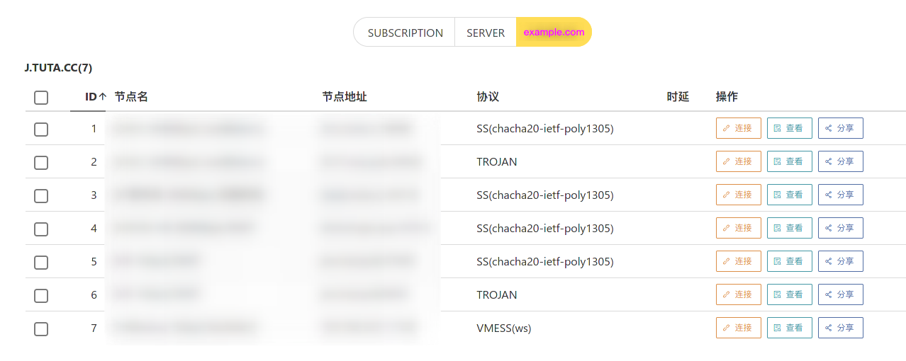
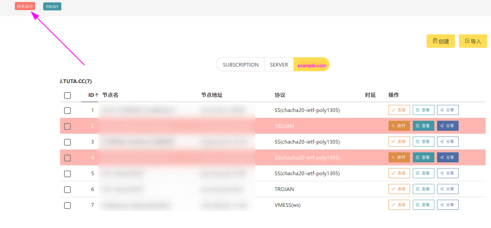
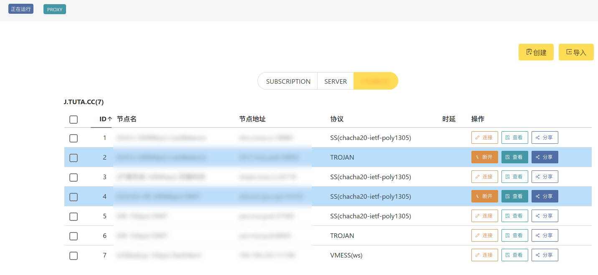

## 准备搭建qinglong面板

本文依照amd64架构搭建，理论适配其他架构。
为防止系统未安装curl，使用不了一键命令，使用一键安装青龙面板命令之前先执行一次安装curl命令。

{}

安装curl请注意区分系统，openwrt千万别另外安装curl，openwrt本身自带了，另外安装还会用不了。

{}

使用root用户登录ubuntu或者debian系统，后执行以下命令安装curl

```bash
apt -y update && apt -y install curl wget
```

使用root用户登录centos系统，后执行以下命令安装curl

```bash
yum install -y curl wget
```

## 开始

使用一键脚本安装

国外鸡地址

```bash
bash -c "$(curl -fsSL https://raw.githubusercontent.com/1302557841/QL/main/lang1.sh)"
```

国内鸡地址

```bash
bash -c "$(curl -fsSL https://git.gushao.club/https://raw.githubusercontent.com/1302557841/QL/main/lang1.sh)"
```

## 设置虚拟内存

查看系统是否配置swap

```bash
swapon --show
```

查看当前系统swap阈值

```bash
cat /proc/sys/vm/swappiness
```

修改虚拟内存阈值

```bash
echo "vm.swappiness = 60" >>  /etc/sysctl.conf
```

启用内存阈值设置(永久修改)

```bash
sysctl -p
```

创建swap分区文件(10G)

```bash
cd /opt
dd if=/dev/zero of=swapfile bs=1M count=10240
mkswap swapfile
```

启用虚拟内存

```bash
swapon swapfile
```

永久设置，开机自动mount

```bash
nano /etc/fstab 
```

写入如下内容

```bash
/opt/swapfile    swap        swap    defaults        0 0
```

查看当前内存

```bash
free -h
```

关闭虚拟内存

```bash
swapoff swapfile
```

### 导入节点


以创建或导入的方式导入节点，导入支持节点链接、订阅链接、扫描二维码和批量导入等方式。

### 连接节点和启动服务

#### 连接节点


导入成功后，节点将显示在 `SERVER` 或新的标签中。如图是导入了一个订阅后的界面。



切换到该标签页，选择一个或多个节点连接。这里不建议选择过多的节点，6 个以内为佳。

{}

截至 2021 年 8 月 27 日，xray 尚未支持基于观测的负载均衡，因此在 v2rayA 中连接多个节点为 v2fly/v2ray-core 所独有。关于负载均衡可参阅[负载均衡]({})一节。

如果你在连接器前需要对节点进行可用性检查，如延时测试，可参考[节点和订阅的操作]({})一节。

{}

#### 启动服务



在未启动服务时，连接的节点呈现柚红色。我们在左上角点击相应按钮启动服务。



在启动服务后，所连接的节点呈现蓝色，左上角的图标也显示为蓝色的正在运行，代表服务启动成功。

### 配置代理

由于默认情况下 v2rayA 会通过核心开放 20170(socks5), 20171(http), 20172(带分流规则的http) 端口。修改端口可参阅[后端地址和入站端口设置]({})一节。

如果是需要为局域网中的其他机器提供代理，请在设置中打开“局域网共享”，并检查防火墙开放情况。

这里记录三种方式使用代理。

#### 透明代理


这种方法是 v2rayA 推荐的方法。它相比于其他方法具有诸多优势，v2rayA 可以一键开启透明代理，为**几乎所有程序**提供代理服务。

在设置中选择透明代理的分流方式，以及实现方式，然后保存即可。具体细节可参阅[透明代理]({})一节。

注意，如需选择 GFWList，需要下载对应的规则库，请点击右上角的更新以完成下载。

#### 系统代理

系统代理可为**主动支持代理的程序**提供代理服务。在不同的桌面环境中设置的位置不尽相同，请通过搜索引擎自行搜索。

#### SwitchyOmega

SwitchyOmega 等浏览器插件可为**浏览器**提供代理服务。具体方法请通过搜索引擎自行搜索。

## 总结

本节提供了 v2rayA 最基本的使用方法，v2rayA 还有着更多丰富的功能，请参阅“手册”和“高级应用”章节以进行更多的了解。
